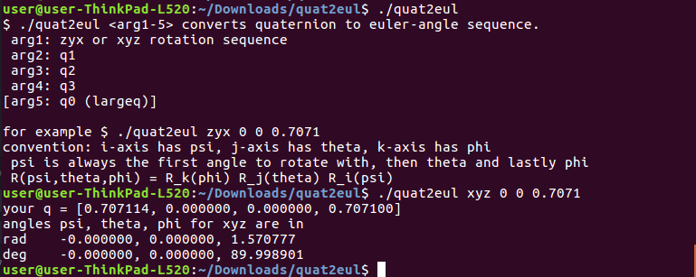

### quat2eul

 - Similar to Matlab but runs from the command line.
 - Supported rotation sequences XYZ and  ZYX 
   more Info: [quat2eul.cpp](quat2eul.cpp)
 - The math implementation is adopted from the technical report of [J Diebel](https://scholar.google.de/scholar?cluster=3204262265835591787)
 - order of the angles stays the same no matter the ijk-sequence, so psi is always the first angle to rotate with, then theta and lastly phi

	 - psi for i
     - theta for j
     - phi  for k

 Licensed under http://opensource.org/licenses/BSD-3-Clause

 
