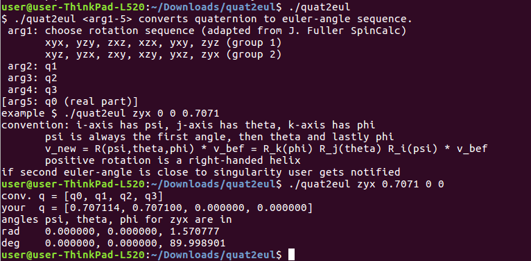
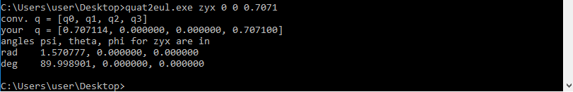

### quat2eul

 - Similar to Matlab but runs from the command line.
 - The math implementation is adopted from the Matlab-Function [SpinCalc](http://de.mathworks.com/matlabcentral/fileexchange/20696-function-to-convert-between-dcm--euler-angles--quaternions--and-euler-vectors) from J. Fuller. You can check the implementation against [WolframAlpha](https://www.wolframalpha.com/input/?i=quaternion:+0.7071%2B0i%2B0j%2B0.7071k) or the technical report of [J Diebel](https://scholar.google.de/scholar?cluster=3204262265835591787).
 - more Info: [quat2eul.cpp](quat2eul.cpp)
 - Prebuild for Windows:
 
 
 

---

 Licensed under http://opensource.org/licenses/BSD-3-Clause

